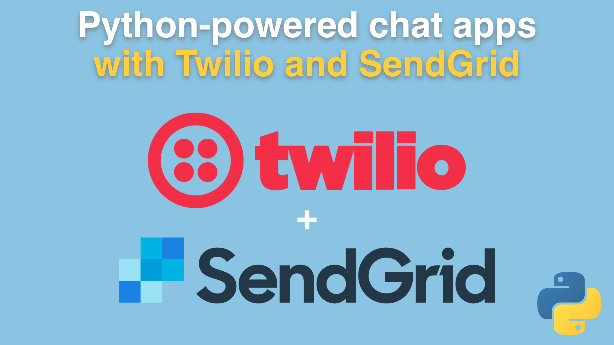
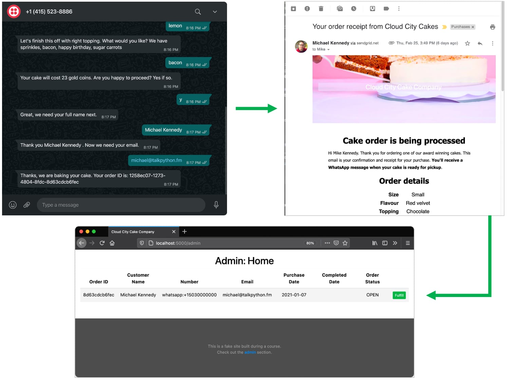

# Python-powered chat apps with Twilio and SendGrid course

Python-powered chat apps with Twilio and SendGrid course code, materials, and handouts.

This course is free and open to everyone. [**Join today**](https://training.talkpython.fm/courses/python-powered-chat-apps-with-twilio-sendgrid-and-flask).

## What's this course about and how is it different?

Many courses will show you a quick how-to with Twilio. In this **free** course, we will build a complete, end-to-end Flask web application with modern Python tools. **You will learn exactly what is needed to truly integrate text/chat with Python**. We'll sketch out the workflow in Twilio Studio and then create a series of HTTP/ JSON APIs in Flask that perform key integration. 

We will add text-intiated ordering for a hypothetical bakery called "Cloud City Cake Company". Over at the Cloud City website, we'll have a quick way to kick off a chat conversation in WhatsApp, hook important stages of that conversation with our Flask APIs, send rich emails and generate PDFs in Python.

Our customers will receive an email invoice as well an unprompted text message when their cake is ready for pickup. At the same time, this integration will communicate with our bakers about what cakes have been ordered and they can indicate when the cakes are finished.

## What we'll build

Here is a visual summary of just some of what you'll build during this course:

* A **Twilio chat interaction over WhatsApp** with validation and API integration
* Rich **email response over SendGrid** with formatted HTML, images, and attached generated PDF
* **A Flask admin backend** to receive the orders and notify users over chat their order is ready

## What topics are covered

In this course, you will:

- Learn how to **build chat workflows in Twilio Studio**
- **Integrate HTTP APIs** (external and ours) with Twilio
- Create **a realistic Flask application**
- **Validate chat responses** and direct the workflow accordingly
- **Define HTTP JSON based endpoints** for APIs with Flask
- Use **Pydantic for declarative data exchange**, validation, and conversion with Flask
- Define **SQLAlchemy ORM** classes to save data to a database
- **Query and update data** with SQLALchemy ORMs classes
- **Send email** using Python and SendGrid
- **Generate a rich PDB** using Jinja2 templates in Python
- **Add attachments** to outbound email
- **Send an unprompted text message** to a user over WhatsApp with Twilio's Python API
- And lots more

View the full [**course outline**](https://training.talkpython.fm/courses/python-powered-chat-apps-with-twilio-sendgrid-and-flask#course_outline).

## Take the course for free

Sound interesting? Take the course 100% free over at Talk Python Training. [**Join here**](https://training.talkpython.fm/courses/python-powered-chat-apps-with-twilio-sendgrid-and-flask).

